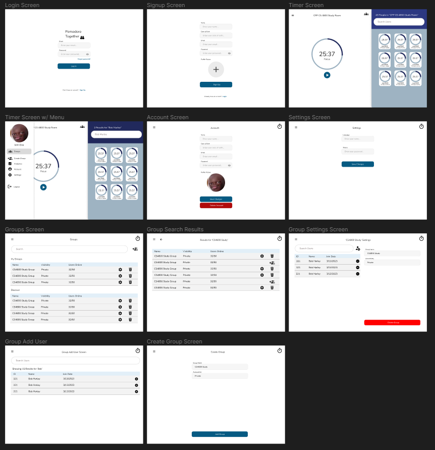

# Pomodoro Together

## Table of Contents
1. [Final Product](#Final-Product)
2. [Overview](#Overview)
3. [Product Spec](#Product-Spec)
4. [Wireframes](#Wireframes)
5. [Schema](#Schema)

## Final Product


## Overview

### Description
Pomodoro Together is a collaborative Pomodoro application hosted on AWS Amplify that was developed using React JS for the frontend and Firebase Realtime Database and Storage for the backend. The app facilitates user collaboration, allowing individuals to join interactive study sessions and easily observe other participants' timers. With the aim of reducing the boredom of solo study sessions, Pomodoro Together acts as a way increase productivity through group participation. Users can easily create groups and navigate between them. 

The app also features a social aspect with custom user profiles allowing users to identify the top performers in a study session. An analytics screen is also available to provide insights on user progress while also highlighting the top 5 users of the application.


### App Evaluation
- **Category:** Productivity / Social Networking
- **Platform:** This app is primarily developed for the web, but it can be used on a handheld device since the UI changes with the width of the screen.
- **Story:** Allows users to engage in collaborative Pomodoro timer sessions which increases productivity and engagement in any task they're performing. With this platform, users can view other people's timers, join different group sesssions, and also compare their stats with others.
- **Market:** Individuals interested in time management, productivity tools, and collaborative study sessions would be the target audience. This would cater to a diverse user base ranging from students to professionals looking to increase their productivity.
- **Habit:** Users would use this app regularly while working, studying, or managing tasks. It may be used multiple time per day.
- **Scope:** This app will first focus on the collaborative Pomodoro sessions, so a lot of work will primarily be put into the real-time timers. Later versions of the app could include chat functionality, public/private sessions, enhanced user profiles, friend system, and possibly integration with other productivity tools (like Google Calendar or Notion).

## Product Spec

### 1. User Stories (Required and Optional)

**Required Must-have Stories**
- [X] User can register for a new account, and this gets stored to a database for the user to log in later.
- [X] Menu Component allows for users to navigate between different screens.
- [x] Other Timers component created for other user timers.
- [x] Main timer component to view your own timer (with pause, play, and stop functionality).
- [x] Group screen to view and join other groups in table form.
- [x] Search bar component for filtering results.
- [x] User can upload a profile picture and this gets stored in Firebase Storage.
- [x] Users can create their own groups.
- [ ] Users can add and remove users to their group.
- [ ] Users can edit the group settings for their own group.
- [x] Users can delete their own groups.

**Optional Nice-to-have Stories**
- [ ] Settings screen for user to customize the app to their liking.
- [ ] Ability to change the theme of the app through the Settings screen.
- [ ] More user information stored for personalization (such as birthdate).
- [ ] Birthday/holiday messages displayed for users.
- [ ] Users can add each other (similar to other social media platforms).
- [ ] Users can click on each others' names to view user profiles.
- [ ] Timer can be dragged to change by the second (allows for better time scrolling).
- [ ] Chat functionality for a group.
- [ ] Better UI for the analytics screen (and more insights).
- [X] UI similar to the figma page.
     - Continuous Progress

### 2. Screen Archetypes

* Login/Signup Screen
   * User can register for a new account and login to this account.
* Timer Screen
   * User can view their timer while also viewing the timers of other individuals.
   * Other individual timers are grouped together, and usernames can be searched for.
* Menu (Component)
   * Features a way to navigate throughout the app.
   * Can navigate to Groups, Create Group, Analytics, Account, Settings, and Login Screen (through Logout).
* Account Screen
   * Users can change their account settings (ex. Name, Email, Date of Birth, etc.)
* Settings Screen
   * User can access settings such as the website theme.
 * Groups Screen
   * Users can view their groups under "My Groups" while also being able to discover new groups under "Discover".
   * Users can navigate to a settings screen and also delete groups for groups they own.
   * Users can view the accessbility (public or private) of the group while also seeing how many users are online.
   * Users can also use a search bar to search for groups.
 * Group Search Results Screen
   * Users can view the results for their group search.
 * Group Settings Screen
   * Users can change the settings of their group screen.
   * Users can be searched for and remove/blocked from the study session.
   * Group name and accessiblity can be changed.
   * Users can be invited to the group session.
 * Group Add User Screen
   * Users can add new members to their group by searching for their name.
 * Create Group Screen
   * Groups can be easily created with a group name, number of members, and accessbility.

### 3. Navigation

**Tab Navigation** (Switch to different Screens through Menu Component)

* Groups
  * Group Search Results
  * Group Settings
    * Group Add User
* Create Group
* Analytics
* Account
* Settings
* Logout (Navigates to Login Screen)

## Wireframes

### Digital Wireframe



[Link to Figma](https://www.figma.com/file/0AexYwh1OhwmSkBwzqPawq/PomodoroTogether?type=design&node-id=0%3A1&mode=design&t=JShyRqysyiCsSMX2-1)


## Schema 

### Firebase Realtime Database Structure (Example)
- Root
  - groups
    - groupId_1
      - name: "Study Room 1"
      - roomCapacity: 10
      - users
        - userId_1
          - isRunning: false
          - maxTime: 180
          - timer: 109
        - ...
    - groupId_2
      - name: "Study Room 1"
      - roomCapacity: 10
      - ...
    - ...
  - users
    - userId_1
      - currGroup: groupId_1
      - focusTime
        - 2023-11-30: 282
        - ...
      - totalFocusTime: 566
      - username: TestUser1
    - userId_2
      - ...
    - ...

### Firebase Storage

User profile pictures are stored in the main storage unit. They are named with the user's unique user ID.

### Firebase Realtime Database Networking Examples

#### Timer Screen

- **Read/GET User's Current Group:**
  Fetches the current group of the logged-in user.

    ```javascript
    const userRef = ref(database, "users/" + userId + "/currGroup");
    onValue(userRef, (snapshot) => {
      const currentGroup = snapshot.val();
      setCurrGroup(currentGroup);
      // Additional logic
    });
    ```

#### UserTimer Component

- **Read/GET User's Focus Time:**
  Retrieves a user's focus time data for the current date while storing that in a format useable for the application.

    ```javascript
    const userRef = ref(database, "users/" + userId);
    onValue(userRef, (snapshot) => {
      const user = snapshot.val();
      const userDetails = {
        username: user.username,
        hoursFocused:
          user.focusTime && user.focusTime[getCurrentDate()]
            ? user.focusTime[getCurrentDate()]
            : 0,
      };
      // Additional logic
    });
    ```

#### Setting User's Running Status

- **Write/POST User's Timer Status:**
  Sets the user's running status within a specific group to `true` to start the timer on every individuals' screen.

    ```javascript
    set(
      ref(
        database,
        "groups/" + currGroup + "/users/" + auth.currentUser.uid + "/isRunning"
      ),
      true
    );
    ```

These examples illustrate how Firebase Realtime Database queries can be performed in a React application using Firebase SDK methods (`ref`, `onValue`) to retrieve and update data related to users, groups, and focus time.
